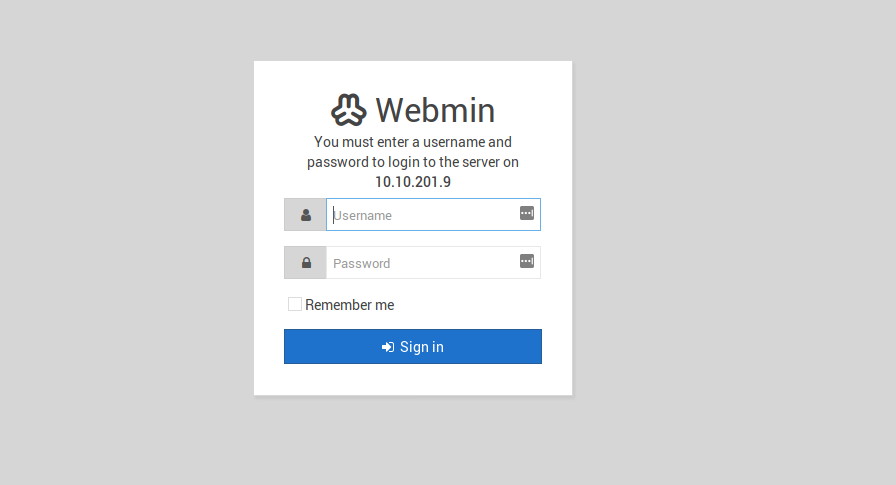
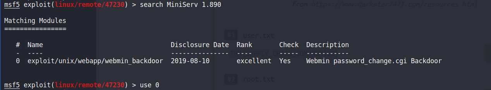
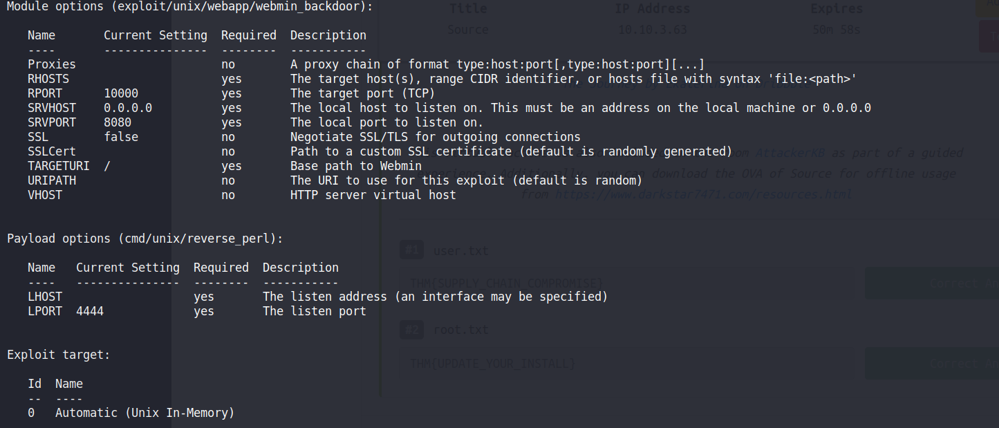
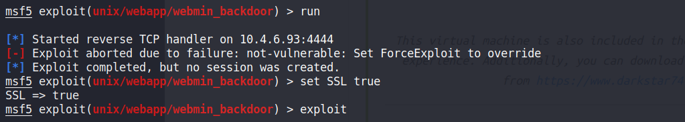

## Source by Tryhackme

[Room Link](https://tryhackme.com/room/source)


```
This is on https so you need to supply https method to url
```


#### Prompts
#1 user.txt

#2 root.txt


After some time of researching I found a metasploit module for getting the root of the machine
so I quickly booted up metasploit and searched for MiniServ 1.890 as the version revealed by our nmap scans




```
Setting all the required options
```



```
also set ssl to true
```



run the exploit

```
once we get the shell Tada!!! we are root.
Just traversing through the directories you will find both the flags
```

I also found another resource by 
[0xstain](https://github.com/0xstain/WebMin-1.890-Exploit-unauthorized-RCE) it is also a cool exploit just go through it!!!

